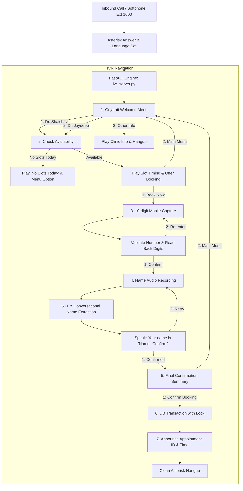

# Asterisk Gujarati Doctor Appointment IVR System (TOPH-IVR)

[](https://www.asterisk.org/)
[](https://www.python.org/)
[]()
[-purple.svg)]()
[]()

A complete, production-grade automated Doctor Appointment Booking IVR (Interactive Voice Response) system built natively for **Asterisk PBX** in **Gujarati (`gu-IN`)**. Migrated from Exotel cloud telephony, this repository provides complete dialplan routing, FastAGI/AGI application state machines, intelligent speech recognition with name extraction, dynamic neural text-to-speech synthesis (1.5x pacing), and atomic transactional database booking with concurrency locking.

---

## Table of Contents

- [Project Overview & Key Features](#project-overview--key-features)
- [IVR Flow Architecture](#ivr-flow-architecture)
- [Tech Stack](#tech-stack)
- [Project Structure](#project-structure)
- [Prerequisites & Versions](#prerequisites--versions)
- [Environment Variables (.env)](#environment-variables-env)
- [Step-by-Step Installation](#step-by-step-installation)
  - [Method 1: Local Terminal Simulation (No Asterisk Needed)](#method-1-local-terminal-simulation-no-asterisk-needed)
  - [Method 2: Windows WSL 2 (Ubuntu)](#method-2-windows-wsl-2-ubuntu)
  - [Method 3: Native Linux Server (Ubuntu / Debian)](#method-3-native-linux-server-ubuntu--debian)
  - [Method 4: Docker & Docker Compose](#method-4-docker--docker-compose)
- [Making a Real Live Call (MicroSIP / Zoiper)](#making-a-real-live-call-microsip--zoiper)
- [Speech-to-Text & Conversational Name Extraction](#speech-to-text--conversational-name-extraction)
- [Text-to-Speech Engine & Voice Speed](#text-to-speech-engine--voice-speed)
- [Database Schema & Transactional Locking](#database-schema--transactional-locking)
- [Available Commands & Scripts](#available-commands--scripts)
- [Automated Testing Suite](#automated-testing-suite)
- [Common Errors & Troubleshooting](#common-errors--troubleshooting)
- [Production Deployment Guide](#production-deployment-guide)

---

## Project Overview & Key Features

* **Gujarati Welcome Menu**: Dual doctor selection (Dr. Shaishav / Dr. Jaydeep) and clinic information announcement.
* **Real-time Slot Availability**: Checks doctor schedules for the current date, announces next available timings in Gujarati, and informs if slots are exhausted.
* **Mobile Number Validation**: Captures 10-digit Indian mobile numbers (`^[6-9]\d{9}$`), speaks back digits, and requests explicit patient confirmation with retries.
* **Conversational Name Capture**:
  * Asterisk records the caller's voice stream.
  * Speech recognition transcribes in real-time (`gu-IN` and `en-IN`).
  * **Intelligent Name Cleaner**: Strips conversational preambles (e.g. *"My name is Dev"*, *"મારું નામ દેવ સોલંકી છે"*, *"This is Dev"*) to extract **only the clean name** (`Dev` / `Dev Solanki`).
* **1.5x Paced Neural Voice**: Optimized prompt playback speed (+45% / 1.5x) for crisp, professional IVR pacing without dragging.
* **Concurrency Locking**: Atomic SQLite transactions with `BEGIN IMMEDIATE` row-level capacity verification to prevent race-condition double bookings.
* **Fallback Mechanisms**: Zero-friction local development—runs with Sarvam AI API when configured, or automatic local Neural Edge-TTS + Google Speech Recognition fallbacks.

---

## IVR Flow Architecture



---

## Tech Stack

| Layer | Technology | Description |
| :--- | :--- | :--- |
| **PBX Engine** | Asterisk 20 / 22 LTS | PJSIP channel driver, Dialplan execution, RTP media |
| **Telephony Interface** | Python FastAGI / Standard AGI | Async TCP socket protocol on port `4573` |
| **Language & Runtime**| Python 3.10+ | Asyncio, Dataclasses, Requests, Aiohttp |
| **Speech-to-Text (STT)**| Sarvam AI / Google Speech | Gujarati (`gu-IN`) & Indian English (`en-IN`) |
| **Text-to-Speech (TTS)**| Edge-TTS / Sarvam AI | Gujarati Neural (`gu-IN-DhwaniNeural`), 1.5x pacing |
| **Audio Processing** | SoX / Wave | 8000 Hz, 16-bit, Mono Linear PCM WAV format |
| **Database** | SQLite 3 (WAL mode) | Transactional locking (`BEGIN IMMEDIATE`) |
| **Containerization** | Docker / Docker Compose | Debian Bookworm + Asterisk 22 + Python 3.14 |

---

## Project Structure

```
TOPH-IVR/
├── agi/                       # FastAGI & Standard AGI State Machine
│   ├── __init__.py
│   ├── agi_channel.py         # Bidirectional Asterisk AGI protocol handler
│   ├── ivr_engine.py          # State machine logic matching IVR diagram
│   ├── ivr_handler.py         # Standalone AGI executable for agi-bin
│   ├── server.py              # Async FastAGI TCP daemon (port 4573)
│   └── session.py             # Call session state container
├── asterisk_config/           # Production Asterisk configuration files
│   ├── extensions.conf        # Dialplan routing into FastAGI
│   ├── modules.conf           # Essential Asterisk module loader configuration
│   ├── pjsip.conf             # PJSIP Transports, Endpoints, Auth, and AORs
│   └── rtp.conf               # RTP port allocations (10000-20000)
├── models/                    # Data models
│   ├── __init__.py
│   └── schema.py              # Doctor, Schedule, Patient, Appointment classes
├── scripts/                   # CLI utilities and testing tools
│   ├── generate_prompts.py    # Pre-renders static Gujarati audio prompts
│   ├── seed_db.py             # Seeds doctors, schedules, and test slots
│   ├── simulate_call.py       # Interactive terminal simulator (no Asterisk required)
│   ├── test_audio_flow.py     # Native speaker simulator
│   └── test_sip_register.py   # SIP authentication & registration tester
├── services/                  # Business & external integration services
│   ├── __init__.py
│   ├── db_service.py          # SQLite database service with concurrency lock
│   ├── stt_service.py         # STT client with conversational name cleaner
│   └── tts_service.py         # 1.5x Gujarati TTS engine with disk caching
├── sounds/                    # Native Asterisk sound library
│   ├── cache/                 # Dynamically generated TTS prompts (.gitkeep)
│   └── gu/                    # Pre-rendered 8000Hz 16-bit Mono Gujarati WAVs
├── tests/                     # Comprehensive automated test suite
│   ├── test_db_service.py     # Database concurrency, upserts & locking tests
│   ├── test_ivr_engine.py     # All 7 branches of IVR state machine
│   └── test_stt_tts.py        # STT name extraction & WAV format compliance
├── .env.example               # Example environment variables
├── .gitignore                 # Production Git ignore rules
├── docker-compose.yml         # Container runner
├── docker-entrypoint.sh       # Container initialization and startup script
├── Dockerfile                 # Multi-stage production container definition
├── requirements.txt           # Python dependencies
└── setup_wsl.sh               # 1-click installer for Windows WSL 2
```

---

## Prerequisites & Versions

* **Operating System**: Linux (Ubuntu 22.04 / 24.04 / Debian 12) or Windows 10/11 with WSL 2.
* **Python**: `3.10` or higher.
* **Asterisk**: Asterisk 18, 20, or 22 LTS with `res_pjsip` and `res_agi` modules enabled.
* **Audio Tools**: `sox` (Sound eXchange) for 8kHz linear PCM conversion.

---

## Environment Variables (.env)

Copy `.env.example` to `.env`:

```bash
cp .env.example .env
```

| Variable | Required | Default | Description |
| :--- | :---: | :---: | :--- |
| `SARVAM_API_KEY` | Optional | `""` | Sarvam AI API subscription key for STT/TTS. If omitted, the system automatically uses Edge-TTS (1.5x) and Google Speech Recognition for free. |
| `ASTERISK_SOUNDS_DIR` | Optional | `./sounds` | Base directory for Asterisk sounds (`/var/lib/asterisk/sounds/ivr` on Linux/Docker). |
| `ASTERISK_CACHE_DIR` | Optional | `./sounds/cache` | Directory for dynamically synthesized voice files. |

---

## Step-by-Step Installation

### Method 1: Local Terminal Simulation (No Asterisk Needed)

You can test and develop the entire Gujarati IVR flow immediately on any Windows, macOS, or Linux machine without installing Asterisk:

```bash
# 1. Clone the repository
git clone https://github.com/D03SOLANKI/TOPH-IVR.git
cd TOPH-IVR

# 2. Install Python dependencies
pip install -r requirements.txt

# 3. Initialize and seed the appointment database
python scripts/seed_db.py

# 4. Generate all 8000Hz Gujarati audio prompts
python scripts/generate_prompts.py

# 5. Run the interactive CLI call simulator
python scripts/simulate_call.py
```

---

### Method 2: Windows WSL 2 (Ubuntu)

If developing on Windows, run Asterisk inside WSL 2:

```bash
# 1. Open PowerShell and install Ubuntu if not already installed
wsl --install Ubuntu

# 2. Inside Ubuntu (WSL), run the automated setup script
sudo bash setup_wsl.sh
```

The script automatically:
* Installs Asterisk, Python, SoX, and audio packages.
* Installs Python packages.
* Copies `asterisk_config/*` into `/etc/asterisk/`.
* Deploys Gujarati audio files into `/var/lib/asterisk/sounds/ivr/gu/`.
* Starts the Asterisk service and launches the FastAGI server on port `4573`.

---

### Method 3: Native Linux Server (Ubuntu / Debian)

```bash
# 1. Update and install packages
sudo apt-get update
sudo apt-get install -y asterisk asterisk-modules asterisk-core-sounds-en python3 python3-pip sox net-tools

# 2. Clone repo and install requirements
git clone https://github.com/D03SOLANKI/TOPH-IVR.git /opt/TOPH-IVR
cd /opt/TOPH-IVR
pip3 install -r requirements.txt

# 3. Deploy Asterisk configuration
sudo cp asterisk_config/extensions.conf /etc/asterisk/
sudo cp asterisk_config/pjsip.conf /etc/asterisk/
sudo cp asterisk_config/rtp.conf /etc/asterisk/
sudo cp asterisk_config/modules.conf /etc/asterisk/

# 4. Deploy audio prompts
sudo mkdir -p /var/lib/asterisk/sounds/ivr/gu
sudo mkdir -p /var/lib/asterisk/sounds/ivr/cache
sudo cp sounds/gu/* /var/lib/asterisk/sounds/ivr/gu/
sudo chown -R asterisk:asterisk /var/lib/asterisk/sounds/ivr

# 5. Seed database & start FastAGI daemon
python3 scripts/seed_db.py
nohup python3 agi/server.py --host 127.0.0.1 --port 4573 > /var/log/fastagi.log 2>&1 &

# 6. Reload Asterisk
sudo asterisk -rx "core reload"
sudo asterisk -rx "pjsip reload"
```

---

### Method 4: Docker & Docker Compose

Deploy the complete stack in a single command:

```bash
# Optional: export your Sarvam key if available
export SARVAM_API_KEY="your_api_key"

# Build and start container
docker compose up -d --build
```

---

## Making a Real Live Call (MicroSIP / Zoiper)

You can place live audio calls from your PC or smartphone using any SIP softphone app:

### MicroSIP Configuration (Windows):
1. Download [MicroSIP](https://www.microsip.org/).
2. Go to **Menu ➔ Add Account**:
   * **Account Name**: `Asterisk IVR`
   * **SIP Server**: `127.0.0.1` *(or your server's IP address)*
   * **Username**: `100`
   * **Domain**: `127.0.0.1`
   * **Login**: `100`
   * **Password**: `secretpassword123`
   * **Transport**: `TCP` *(Important: select TCP)*
3. Click **Save**. The bottom-left indicator will turn **Green (Online)**.
4. Dial **`1000`** and click **Call**.

### Zoiper Configuration (Android / iOS):
1. Install Zoiper from the Play Store / App Store.
2. In the setup screen:
   * **Username @ PBX**: `100@<SERVER_IP>`
   * **Password**: `secretpassword123`
3. Select **SIP TCP** or **SIP UDP**.
4. Dial **`1000`** to connect to the IVR.

---

## Speech-to-Text & Conversational Name Extraction

When prompted to state their name, callers rarely say a single isolated word. They often use natural phrases:

| Caller Says | Extracted Patient Name |
| :--- | :--- |
| `"My name is Dev"` | **`Dev`** |
| `"Hello, my name is Dev Solanki"` | **`Dev Solanki`** |
| `"This is Dev"` | **`Dev`** |
| `"I am Dev Solanki"` | **`Dev Solanki`** |
| `"મારું નામ દેવ છે"` | **`દેવ`** |
| `"મારું નામ દેવ સોલંકી છે"` | **`દેવ સોલંકી`** |
| `"હું દેવ બોલું છું"` | **`દેવ`** |
| `"मेरा नाम देव है"` | **`देव`** |

The extractor ([`services/stt_service.py`](file:///e:/AsterikIVR/services/stt_service.py)):
1. Transcribes audio using Sarvam STT (or Google Speech Recognition fallback).
2. Cleans punctuation, preambles, and filler words.
3. Automatically capitalizes names for database storage and dynamic read-back.

---

## Text-to-Speech Engine & Voice Speed

* **Speed**: Generated at **1.5x pacing** (`--rate=+45%`), preventing long, slow pauses in traditional automated phone trees.
* **Audio Format**: Converted by SoX to **8000 Hz, 1-channel Mono, 16-bit linear PCM (`WAVE_FORMAT_PCM`)**, matching Asterisk telephony standards.
* **Smart Caching**: Dynamically synthesized phrases (such as appointment codes and numbers) are hashed and cached in `sounds/cache/` so identical text is synthesized only once.

---

## Database Schema & Transactional Locking

The database utilizes SQLite with **WAL (Write-Ahead Logging)** mode and row-level atomic locks via `BEGIN IMMEDIATE` in [`services/db_service.py`](file:///e:/AsterikIVR/services/db_service.py):

```sql
-- Doctors Table
CREATE TABLE doctors (
    id INTEGER PRIMARY KEY,
    name_en TEXT NOT NULL,
    name_gu TEXT NOT NULL,
    specialty_en TEXT,
    specialty_gu TEXT,
    is_active INTEGER DEFAULT 1
);

-- Doctor Schedules Table
CREATE TABLE doctor_schedules (
    id INTEGER PRIMARY KEY AUTOINCREMENT,
    doctor_id INTEGER NOT NULL,
    day_of_week INTEGER NOT NULL, -- 0=Mon, 6=Sun
    start_time TEXT NOT NULL,
    end_time TEXT NOT NULL,
    slot_time_gu TEXT NOT NULL,
    slot_time_en TEXT NOT NULL,
    max_slots INTEGER DEFAULT 10,
    is_active INTEGER DEFAULT 1
);

-- Patients Table (Upserted by mobile)
CREATE TABLE patients (
    id INTEGER PRIMARY KEY AUTOINCREMENT,
    mobile_number TEXT UNIQUE NOT NULL,
    name_gu TEXT NOT NULL,
    created_at TIMESTAMP DEFAULT CURRENT_TIMESTAMP,
    updated_at TIMESTAMP DEFAULT CURRENT_TIMESTAMP
);

-- Appointments Table
CREATE TABLE appointments (
    id INTEGER PRIMARY KEY AUTOINCREMENT,
    appointment_code TEXT UNIQUE NOT NULL, -- e.g. APT-1001
    doctor_id INTEGER NOT NULL,
    patient_id INTEGER NOT NULL,
    appointment_date TEXT NOT NULL,        -- YYYY-MM-DD
    slot_time TEXT NOT NULL,
    status TEXT DEFAULT 'CONFIRMED',
    created_at TIMESTAMP DEFAULT CURRENT_TIMESTAMP
);
```

### Race-Condition Protection
When booking, `book_appointment()` executes `BEGIN IMMEDIATE` to acquire an exclusive lock, recalculates remaining slots in real time, commits the appointment, and generates a unique appointment code (`APT-1001`). If another caller claims the final slot during the call, the transaction cleanly rolls back and routes the caller to the slot-full announcement.

---

## Available Commands & Scripts

| Script | Purpose |
| :--- | :--- |
| `python scripts/seed_db.py` | Initializes SQLite schema and seeds Dr. Shaishav and Dr. Jaydeep schedules. |
| `python scripts/generate_prompts.py` | Synthesizes all static Gujarati prompt WAV files at 1.5x speed into `sounds/gu/`. |
| `python scripts/simulate_call.py` | Interactive terminal IVR simulator; steps through the call without Asterisk. |
| `python scripts/test_audio_flow.py` | Native audio simulator that plays voice prompts through your computer speakers. |
| `python scripts/test_sip_register.py` | Diagnostic script that tests raw SIP socket registration with Asterisk on port 5060. |
| `python -m pytest tests/ -v` | Executes the 16-test automated unit and integration suite. |

---

## Automated Testing Suite

The test suite covers database locking, state machine transitions, audio format compatibility, and name extraction:

```bash
python -m pytest tests/ -v
```

### Verified Tests:
* `test_db_service.py`: Doctors seeded, availability queries, appointment bookings, patient upserts, and slot exhaustion concurrency.
* `test_ivr_engine.py`: Happy path booking (Dr. Shaishav), Dr. Jaydeep booking, clinic information menu, no-slots handling, invalid mobile retry, name re-prompting, and final confirmation cancellations.
* `test_stt_tts.py`: Speech recognition fallback, conversational name extraction (`test_extract_clean_name`), 8kHz 16-bit Mono WAV validation, and audio cache reuse.

---

## Common Errors & Troubleshooting

### 1. "404 Not Found" on Softphone Registration
* **Cause**: In Asterisk PJSIP, the AOR name must match the username registered.
* **Fix**: Verify [`asterisk_config/pjsip.conf`](file:///e:/AsterikIVR/asterisk_config/pjsip.conf) defines `[100]` for `type=endpoint`, `type=auth`, and `type=aor`.

### 2. "503 Service Unavailable" on Dialing 1000
* **Cause**: Asterisk cannot connect to the FastAGI server on `agi://127.0.0.1:4573/ivr`.
* **Fix**: Ensure the Python server is running:
  ```bash
  python3 agi/server.py --host 127.0.0.1 --port 4573
  ```

### 3. Audio Prompts Play as a Beep Sound
* **Cause**: Placeholder sine-wave tones were generated when no TTS engine was reachable.
* **Fix**: Ensure `edge-tts` and `sox` are installed, and regenerate the prompts:
  ```bash
  python3 scripts/generate_prompts.py
  ```

### 4. Windows WSL 2 Softphone Connection Fails
* **Cause**: Windows Firewall blocks UDP broadcast between the Windows host and WSL 2.
* **Fix**: Configure MicroSIP to use **`TCP`** transport and server **`127.0.0.1`** (or your WSL internal IP `172.x.x.x`).

---

## Production Deployment Guide

### Connecting to a Live PSTN / Telecom SIP Trunk
To receive calls from real mobile phone numbers (e.g. via Tata Tele, Airtel, Twilio, or Exotel):
1. In [`asterisk_config/pjsip.conf`](file:///e:/AsterikIVR/asterisk_config/pjsip.conf), configure `[trunk-endpoint]` with your telecom provider's SIP URI and credentials.
2. In your telecom provider dashboard (e.g. Exotel Passthru or SIP Trunk), route your virtual number to:
   ```text
   sip:s@<YOUR_PUBLIC_SERVER_IP>:5060
   ```
3. Open firewall ports:
   * **SIP Signaling**: `5060/UDP` & `5060/TCP`
   * **RTP Media**: `10000-20000/UDP`

---

## License

This project is licensed under the MIT License.
