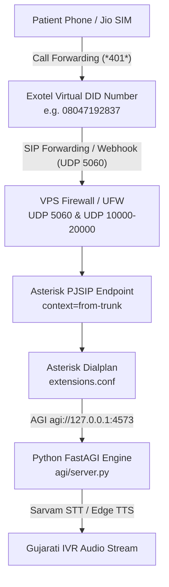

# Exotel Virtual Number & SIP Trunking to Asterisk Integration Guide

> **Target Audience**: Systems Administrators, DevOps Engineers, and Telephony Integrators  
> **System**: Trinay Orthopedic Hospital Gujarati IVR System  
> **Repository**: `yashprajapati1411/IVR-Asterisk`  

---

## Architecture Overview



---

## STEP 1: Exotel Account Creation & Business Verification (KYC)

Due to TRAI (Telecom Regulatory Authority of India) regulations, all virtual numbers and SIP trunks in India require enterprise KYC verification.

### 1.1 Sign Up on Exotel
1. Go to [https://exotel.com](https://exotel.com) and click **Sign Up** / **Start Free Trial**.
2. Enter your Business Email, Phone Number, and Company Name (*Trinay Orthopedic Hospital*).
3. Verify your email address and OTP sent to your mobile.

### 1.2 Submit Mandatory TRAI KYC Documents
Navigate to **Account Settings** -> **KYC & Verification** in the Exotel Dashboard:
- **Business Identity Proof**: GST Registration Certificate or Shop & Establishment License.
- **Company PAN Card**: Copy of Business / Hospital PAN.
- **Authorized Signatory ID**: Aadhaar Card / Passport of the hospital manager or account holder.
- **Letter of Authorization**: Signed letter on hospital letterhead authorizing the account holder to operate telephony services.

> [!NOTE]  
> KYC approval typically takes **12 to 24 hours**.

---

## STEP 2: Procuring a Virtual DID Number (Exophone)

Once KYC is approved, you will get access to procure a Virtual DID Number (Exophone).

1. Log in to your **Exotel Dashboard**.
2. Go to **Admin** (top right) -> **Exophones** (Virtual Numbers).
3. Click **Buy Exophone** or **Request New Number**.
4. Select preferences:
   - **Country / Circle**: India / Gujarat (or National Landline/Mobile DID).
   - **Number Type**: Landline DID (e.g. `079-XXXX-XXXX`) or 10-Digit Mobile DID (e.g. `0804719XXXX`).
5. Click **Confirm Procurement**.
6. Note down your assigned **Exophone Number** (e.g., `08047192837`).

---

## STEP 3: Configuring Exotel Call Flow / SIP Forwarding

You need to tell Exotel to forward incoming calls on your Virtual Number to your **Cloud VPS Public IP address**.

### Method 1: App Bazaar Call Flow Builder (Recommended)

1. In Exotel Dashboard, click **App Bazaar** (or **Flows**).
2. Click **Create New Flow**.
3. Name your flow: `Hospital Gujarati IVR SIP Flow`.
4. Drag and drop a **Passthru Applet** (or **Connect Applet**) into the canvas:
   - **Applet Name**: `Forward to Asterisk Cloud VPS`
   - **Passthru URL / Target SIP URI**:
     ```text
     sip:100@<YOUR_PUBLIC_CLOUD_VPS_IP>:5060
     ```
     *(Replace `<YOUR_PUBLIC_CLOUD_VPS_IP>` with your actual Cloud VPS Public IP address, e.g. `139.59.123.45`)*
   - **HTTP Method**: `POST` (or SIP Direct)
   - **Format**: Send Caller ID (PSTN Number) as `agi_callerid`.
5. Save and **Publish** the Flow.
6. Attach the Flow to your Virtual DID Number:
   - Go to **Admin** -> **Exophones**.
   - Next to your Virtual Number, click **Assign Flow** -> Select `Hospital Gujarati IVR SIP Flow`.

---

## STEP 4: Configuring VPS Firewall & Cloud Networking

Asterisk requires raw UDP traffic for SIP signaling and RTP voice streams. You must open these ports on your Cloud VPS (DigitalOcean / Hetzner / AWS EC2).

### 4.1 UFW Firewall Configuration (Ubuntu/Debian VPS)
Run the following commands on your VPS terminal:

```bash
# Allow SSH
sudo ufw allow 22/tcp

# Allow FastAPI Dashboard
sudo ufw allow 8000/tcp

# Allow FastAGI Engine
sudo ufw allow 4573/tcp

# Allow SIP Signaling (UDP 5060)
sudo ufw allow 5060/udp
sudo ufw allow 5060/tcp

# Allow RTP Media Range (UDP 10000 - 20000)
sudo ufw allow 10000:20000/udp

# Enable Firewall
sudo ufw enable
```

### 4.2 AWS EC2 / DigitalOcean Security Group Settings
If using AWS EC2 or DigitalOcean Cloud Firewall, add the following Inbound Rules:

| Type | Protocol | Port Range | Source | Purpose |
| :--- | :--- | :--- | :--- | :--- |
| Custom UDP | UDP | `5060` | `0.0.0.0/0` (or Exotel IP Range) | SIP Signaling |
| Custom UDP | UDP | `10000-20000` | `0.0.0.0/0` | RTP Audio Stream |
| Custom TCP | TCP | `8000` | `0.0.0.0/0` | Receptionist Dashboard |

---

## STEP 5: Configuring Asterisk for Exotel SIP Inbound Traffic

Update Asterisk PJSIP and Dialplan configurations on your server so Asterisk trusts and accepts incoming calls from Exotel.

### 5.1 Update `asterisk_config/pjsip.conf`

Open `asterisk_config/pjsip.conf` and configure your Cloud VPS Public IP address and Exotel trunk endpoint:

```ini
[transport-udp]
type=transport
protocol=udp
bind=0.0.0.0:5060
local_net=127.0.0.1/32
external_media_address=<YOUR_PUBLIC_CLOUD_VPS_IP>
external_signaling_address=<YOUR_PUBLIC_CLOUD_VPS_IP>
external_signaling_port=5060
symmetric_transport=yes
allow_reload=yes

; ------------------------------------------------------------------------------
; Exotel Inbound SIP Trunk Endpoint
; ------------------------------------------------------------------------------
[exotel-inbound]
type=endpoint
context=from-trunk
transport=transport-udp
disallow=all
allow=ulaw,alaw,gsm,slin
dtmf_mode=rfc4733
direct_media=no
force_rport=yes
rewrite_contact=yes
rtp_symmetric=yes
insecure=port,invite

[exotel-identify]
type=identify
endpoint=exotel-inbound
match=115.110.0.0/16
match=115.249.0.0/16
match=125.16.0.0/16
```

> [!IMPORTANT]  
> Replace `<YOUR_PUBLIC_CLOUD_VPS_IP>` with your real public IPv4 address (e.g., `139.59.123.45`). Setting `external_media_address` is critical to prevent 1-way audio / silence during calls.

---

### 5.2 Verify `asterisk_config/extensions.conf`

Ensure `asterisk_config/extensions.conf` has the `[from-trunk]` context mapped to FastAGI:

```ini
[from-trunk]
exten => s,1,NoOp(--- Incoming Call from Exotel Virtual Number ---)
 same => n,Set(CHANNEL(language)=gu)
 same => n,Answer()
 same => n,Wait(1)
 ; Executing Gujarati FastAGI Python Engine
 same => n,AGI(agi://127.0.0.1:4573/ivr)
 same => n,Hangup()

exten => _X.,1,Goto(s,1)
exten => _+X.,1,Goto(s,1)
```

---

## STEP 6: Starting System Services & Container Sync

Deploy the updated configurations to your running Asterisk Docker container and start FastAGI + FastAPI servers.

```bash
# 1. Copy updated Asterisk configs to running container
docker cp asterisk_config/pjsip.conf asterisk-gujarati-ivr:/etc/asterisk/pjsip.conf
docker cp asterisk_config/extensions.conf asterisk-gujarati-ivr:/etc/asterisk/extensions.conf

# 2. Restart Asterisk Container to reload SIP configuration
docker restart asterisk-gujarati-ivr

# 3. Start Python FastAGI Server (Port 4573)
python3 agi/server.py --host 0.0.0.0 --port 4573 &

# 4. Start FastAPI Receptionist Dashboard (Port 8000)
python3 -m uvicorn backend.app:app --host 0.0.0.0 --port 8000 &
```

---

## STEP 7: End-to-End Call Testing & Live Troubleshooting

### 7.1 Monitor Live Asterisk CLI Stream
Open Asterisk CLI to watch real-time SIP signaling:

```bash
docker exec -it asterisk-gujarati-ivr asterisk -rvvv
```

### 7.2 Perform Test Calls
1. **Direct Exotel Number Test**:
   - Dial your Exotel Virtual Number (`08047192837`) from your personal phone.
   - You should see Asterisk CLI output: `--- Incoming Call from Exotel Virtual Number ---`.
   - The Gujarati welcome menu audio should play clearly.

2. **Jio Call Forwarding Test**:
   - Take your test Jio SIM phone.
   - Dial `*401*08047192837#` (Forward all calls to Exotel).
   - Call the Jio mobile number from any third-party phone.
   - Verify call routes seamlessly: `Mobile -> Jio Forwarding -> Exotel DID -> Cloud VPS Asterisk -> Gujarati IVR`.

---

## Common Troubleshooting Guide

| Symptom | Probable Cause | Exact Solution |
| :--- | :--- | :--- |
| **No audio / 1-Way Silence** | `external_media_address` in `pjsip.conf` is set to internal IP instead of Public VPS IP. | Set `external_media_address=<YOUR_VPS_PUBLIC_IP>` in `pjsip.conf` and restart Docker container. |
| **Call drops after 5–10 seconds** | RTP UDP ports `10000-20000` are blocked by VPS firewall. | Run `sudo ufw allow 10000:20000/udp` on your VPS. |
| **403 Forbidden on Asterisk CLI** | IP matching missing in `pjsip.conf` `[exotel-identify]`. | Add `match=0.0.0.0/0` temporarily or add Exotel IP subnet in `pjsip.conf`. |
| **STT Name Recognition Fails** | Sarvam API key not set or audio format mismatch. | Verify `SARVAM_API_KEY` in environment variables and ensure `ffmpeg` / `sox` is installed. |
