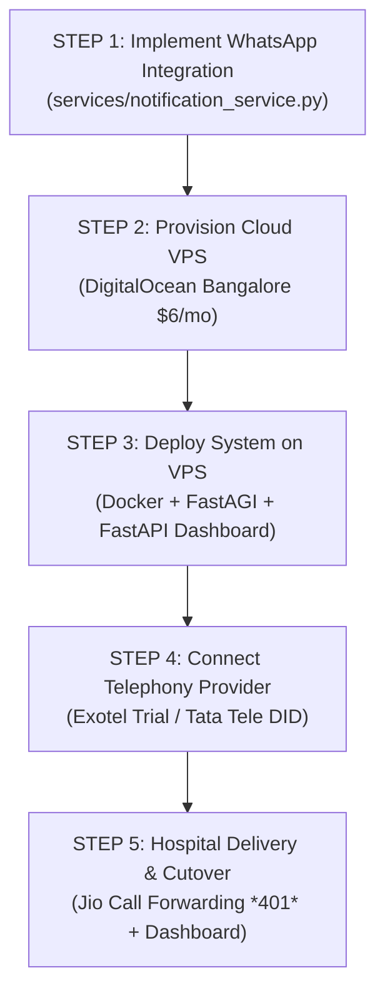

# Trinay Hospital Gujarati IVR System — Master Delivery & Launch Roadmap

> **Document Purpose**: Sequential, step-by-step master plan to resolve all decisions (Messaging, VPS, Telephony, Delivery) and launch the system live for Trinay Orthopedic Hospital.  
> **Repository**: `yashprajapati1411/IVR-Asterisk`  

---

## 🎯 Master Decision Matrix Summary

| Decision Area | Best Choice | Key Reason | Monthly Cost |
| :--- | :--- | :--- | :--- |
| **1. Messaging Channel** | **WhatsApp Cloud API** | 98% open rate, rich text (Doctor, Time, Token, Location), **₹0 setup paperwork** (No DLT registration needed) | **~13.6 Paise / booking** (~₹400–₹800/mo) |
| **2. VPS Hosting** | **DigitalOcean (Bangalore Region)** | **Ultra-low latency (<10ms)** to Indian telecom operators, unrestricted UDP port 5060/RTP support, static Public IPv4 | **$6 / month (~₹500/mo)** |
| **3. Telephony Provider** | **Exotel** (for 1-Mo Test) <br> **Tata Tele Smartflo** (for Production) | **Exotel** for quick 24-hr trial setup.<br>**Tata Tele** for production (Flat ₹1,350/mo, **₹0 per-min call charges**, saving ₹60,000+/year). | **₹1,350 / month flat** (Tata Tele) |
| **4. System Delivery** | **Web Dashboard + Jio Forwarding** | Receptionist uses browser dashboard; Hospital activates `*401*<DID>#` on Jio phone handset. | **Included** |

---

## 🗺️ Master 5-Step Execution Plan

Follow these exact steps in order. Do not skip steps.



---

### STEP 1: Add WhatsApp Confirmation Messaging (Current System Task)

1. **Meta Developer Setup** (5 Mins):
   - Go to [developers.facebook.com](https://developers.facebook.com) -> Create App -> WhatsApp.
   - Create Utility Template `appointment_confirm` (Auto-approved in 2 mins).
2. **Code Integration**:
   - Add `services/notification_service.py` to dispatch non-blocking WhatsApp messages for IVR bookings.
3. **Verification**:
   - Run `python -m pytest tests/` to ensure all 22 tests pass cleanly.

---

### STEP 2: Provision Cloud VPS (DigitalOcean Bangalore)

1. **Why DigitalOcean Bangalore?**:
   - Physical datacenter located in **Bangalore, India**.
   - Ultra-low latency (<10ms) to Indian telephony servers (Exotel / Tata Tele), keeping Gujarati speech recognition & audio streaming crystal clear.
   - Includes dedicated Public IPv4 address.
2. **VPS Specs**:
   - OS: Ubuntu 22.04 LTS
   - Size: 1 vCPU, 2GB RAM, 50GB SSD ($6/month).
3. **Firewall Port Opening**:
   ```bash
   sudo ufw allow 22/tcp          # SSH
   sudo ufw allow 8000/tcp        # Dashboard Web UI
   sudo ufw allow 4573/tcp        # FastAGI Engine
   sudo ufw allow 5060/udp        # SIP Signaling
   sudo ufw allow 10000:20000/udp # RTP Media Streams
   sudo ufw enable
   ```

---

### STEP 3: Deploy System on VPS

1. **Clone Repo on VPS**:
   ```bash
   git clone https://github.com/yashprajapati1411/IVR-Asterisk.git
   cd IVR-Asterisk
   ```
2. **Build & Start Asterisk Docker Container**:
   ```bash
   docker build -t asterisk-gujarati-ivr .
   docker run -d --name asterisk-gujarati-ivr --net=host --restart=always asterisk-gujarati-ivr
   ```
3. **Start Background Python Services**:
   ```bash
   # Launch FastAGI Engine (Port 4573)
   python3 agi/server.py --host 0.0.0.0 --port 4573 &

   # Launch FastAPI Dashboard (Port 8000)
   python3 -m uvicorn backend.app:app --host 0.0.0.0 --port 8000 &
   ```

---

### STEP 4: Connect Telephony Provider (Exotel / Tata Tele)

1. **For 1-Month Trial (Exotel)**:
   - Procure Exophone Virtual DID in Exotel Dashboard.
   - Create App Bazaar flow with Passthru Applet pointing to `sip:100@<VPS_PUBLIC_IP>:5060`.
2. **For Production Launch (Tata Tele Smartflo)**:
   - Submit KYC and get Tata Tele Virtual DID.
   - Configure SIP Destination to `sip:100@<VPS_PUBLIC_IP>:5060`.
3. **Update Asterisk Network IP**:
   - Put VPS IP in `asterisk_config/pjsip.conf` (`external_media_address=<VPS_PUBLIC_IP>`).

---

### STEP 5: Delivery & Cutover to Trinay Orthopedic Hospital

1. **Dashboard Delivery**:
   - Open browser on hospital receptionist desktop -> Bookmark `http://<VPS_PUBLIC_IP>:8000`.
   - Train receptionist on viewing daily token list and booking walk-in patients.
2. **Jio Phone Call Forwarding Cutover**:
   - Take the hospital receptionist Jio mobile handset.
   - Dial `*401*<VIRTUAL_DID_NUMBER>#` and press Call.
   - Test call: Patient calls hospital number -> Calls forward instantly to Gujarati IVR -> Patient receives WhatsApp confirmation!

---

> **Summary**: Follow Step 1 first (WhatsApp integration), then Step 2 (VPS), Step 3 (Deploy), Step 4 (Telephony), and Step 5 (Hospital Handover).
