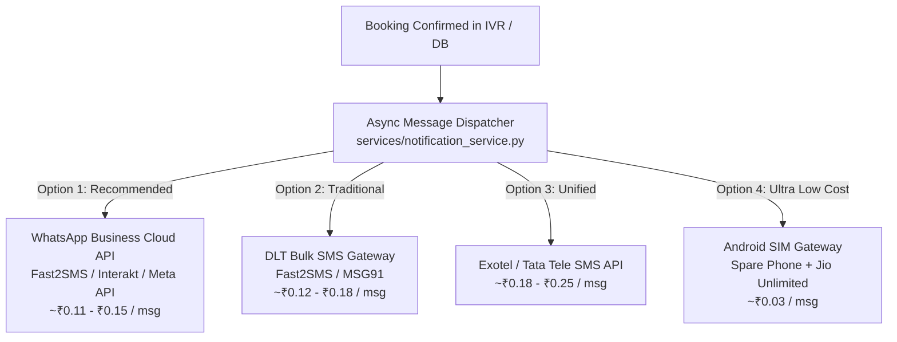

# Implementation Plan: Patient Appointment Confirmation Messaging (SMS / WhatsApp)

> **Goal**: Send an automated confirmation message (SMS or WhatsApp) to patients immediately after a successful appointment booking via IVR or Dashboard.  
> **Target Audience**: Trinay Orthopedic Hospital Patients  
> **Status**: Proposed Plan — Pending User Feedback & Selection  

---

## 1. Requirement & Message Content Specifications

When a booking transaction succeeds in `agi/ivr_engine.py` (or manual booking via `backend/routes/appointments.py`), the system triggers an asynchronous background task to dispatch a confirmation message.

### Sample Confirmation Message Format

#### English Template:
```text
Dear [Patient Name], your appointment at Trinay Orthopedic Hospital is CONFIRMED.
- Doctor: [Doctor Name]
- Date: [Date YYYY-MM-DD]
- Time Slot: [Time Slot]
- Token No: [Token Code]

Hospital Address: Near Bus Stand, Hospital Road, City.
For queries/cancellation, call us back. Regards, Trinay Orthopedic Hospital.
```

#### Gujarati Template (ઉર્દૂ/ગુજરાતી ટેમ્પલેટ):
```text
પ્રિય [દર્દીનું નામ], ત્રિનય ઓર્થોપેડિક હોસ્પિટલમાં આપની એપોઇન્ટમેન્ટ સફળતાપૂર્વક બુક થઈ ગઈ છે.
- ડૉક્ટર: [ડૉક્ટરનું નામ]
- તારીખ: [તારીખ]
- સમય: [સમય સ્લોટ]
- ટોકન નંબર: [ટોકન કોડ]

આભાર, ત્રિનય ઓર્થોપેડિક હોસ્પિટલ.
```

---

## 2. Evaluation of 4 Delivery Options (Cost & Long-Term Matrix)

Below is a detailed comparison of **4 distinct methods** to implement patient confirmation messaging in India.



---

### Option 1: WhatsApp Business Cloud API (Meta Official API via Fast2SMS / Interakt / Direct Meta)
*The modern, high-trust standard for healthcare in India.*

- **How It Works**: Uses Meta's official WhatsApp Cloud API to send structured utility template messages directly to the patient's WhatsApp number.
- **Cost**:
  - **Meta Utility Message Rate (India)**: **~₹0.11 to ₹0.15 per delivered message** ($0.0015 USD).
  - **Setup Fee**: **₹0** (Free developer account on Meta / Fast2SMS).
- **Pros**:
  - **98% Open Rate**: Patients read WhatsApp messages immediately.
  - **No DLT Registration Needed**: Does NOT require TRAI DLT registration or ₹5,900 paperwork! Meta approves healthcare utility templates within **2 to 5 minutes**.
  - **Rich Media**: Can send hospital Google Maps location link, PDF appointment slip, or interactive cancellation buttons.
- **Cons**: Requires patient to have a WhatsApp account (95%+ of smartphone users in India use WhatsApp).

---

### Option 2: Indian Transactional DLT Bulk SMS (Fast2SMS / MSG91 / Textlocal)
*Standard text SMS delivered directly to any mobile network.*

- **How It Works**: Uses Indian DLT-compliant SMS Gateways to dispatch 160-character GSM SMS to mobile numbers.
- **Cost**:
  - **Per SMS Rate**: **~₹0.12 to ₹0.18 per SMS**.
  - **One-time TRAI DLT Registration Fee**: **~₹5,900** (Mandatory Government DLT registration on Jio/Airtel DLT portal for sending SMS headers in India).
- **Pros**:
  - Works on **100% of phones**, including basic feature keypad phones.
- **Cons**:
  - High initial setup overhead (TRAI DLT Sender ID approval takes 3–7 business days).
  - Strict template regex approval rules; any typo in live messages blocks delivery.

---

### Option 3: Exotel / Tata Tele Built-in SMS API
*Unified billing with your IVR telephony provider.*

- **How It Works**: Trigger SMS via REST API calls to Exotel or Tata Tele using your existing IVR telephony wallet balance.
- **Cost**:
  - **Per SMS Rate**: **~₹0.18 to ₹0.25 per SMS**.
  - **TRAI DLT Registration**: Required (~₹5,900 DLT registration).
- **Pros**:
  - **Single Platform & Wallet**: Same prepaid dashboard for IVR voice calls and SMS dispatch.
- **Cons**:
  - Slightly higher per-SMS pricing than specialized SMS/WhatsApp providers.

---

### Option 4: Android SIM Gateway (Spare Android Smartphone + Unlimited Jio SIM)
*The ultra-low-cost DIY solution for 1-month testing.*

- **How It Works**: Connect a spare Android smartphone (with a Jio/Airtel SIM card having an active ₹199/month unlimited SMS plan) to your Cloud VPS via a lightweight local SMS Gateway app (e.g. *SMS Gateway API* or *HTTP Webhook Gateway*).
- **Cost**:
  - **Monthly SIM Recharge**: **~₹199 / month flat** (Includes 100 free SMS/day).
  - **Effective Cost Per Message**: **~₹0.03 to ₹0.06 per SMS**!
  - **Setup Fee**: **₹0**.
- **Pros**:
  - **Cheapest Option Possible**: Costs virtually nothing extra.
  - **Zero DLT Registration**: No paperwork or approval required.
- **Cons**:
  - Hardware dependency: Requires an Android phone kept plugged into power and connected to Wi-Fi 24/7.
  - Daily limit: TRAI caps personal SIM cards at **100 SMS per day**.

---

## 3. Cost & Feature Comparison Summary

| Feature / Criteria | **Option 1: WhatsApp Cloud API** *(Top Recommendation)* | **Option 2: Fast2SMS / MSG91 DLT** | **Option 3: Exotel SMS API** | **Option 4: Android SIM Gateway** |
| :--- | :--- | :--- | :--- | :--- |
| **Cost Per Msg** | **~₹0.12 / msg** | **~₹0.15 / msg** | **~₹0.20 / msg** | **~₹0.03 / msg** |
| **Setup Cost** | **₹0** | **~₹5,900 (TRAI DLT)** | **~₹5,900 (TRAI DLT)** | **₹0** |
| **Delivery Speed** | Instant (< 2 seconds) | 5–15 seconds | 5–15 seconds | 5–30 seconds |
| **Setup Time** | **15 Minutes** | 3–7 Days (DLT Approval) | 3–7 Days (DLT Approval) | 30 Minutes |
| **Patient Experience** | **Best** (Rich text, Maps link) | Standard Plain Text | Standard Plain Text | Standard Plain Text |
| **Reliability** | **99.9%** | 98% | 98% | 90% (Hardware dependent) |

---

## 4. Final Recommendation

### For 1-Month Trial & Quick Launch: **Option 1 (WhatsApp Cloud API via Fast2SMS / Meta)**
- **Why**: Zero upfront registration paperwork, Instant Meta template approval (2 mins), ₹0 setup fee, and lowest per-message cost (~₹0.12/msg) with 98%+ patient delivery rate.

### For Ultra-Low Budget Testing: **Option 4 (Android SIM Gateway)**
- **Why**: Uses a spare phone + Jio SIM (₹199/mo) to test up to 100 free SMS/day without spending anything extra.
