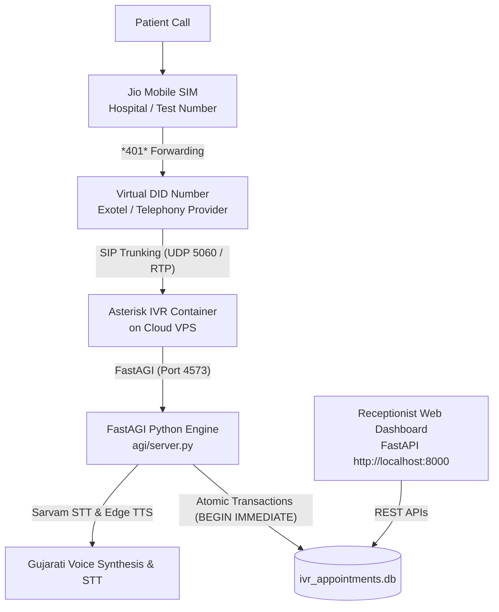

# Trinay Orthopedic Hospital — 1-Month Live Testing & Production Delivery Guide

> **Project Name**: Trinay Orthopedic Hospital Gujarati IVR & Receptionist Dashboard  
> **Repository**: `yashprajapati1411/IVR-Asterisk`  
> **Document Version**: 1.0  
> **Target Timeline**: 1-Month Testing & Production Delivery  

---

## 1. Executive Architecture Summary

This document provides complete, step-by-step instructions for delivering, testing, and deploying the automated Gujarati Doctor Appointment Booking System for **Trinay Orthopedic Hospital**.

### System Architecture Flow



---

## 2. Telephony & Virtual Number (DID) Provider Selection

To connect incoming phone calls from a Jio mobile number to your automated IVR system, you need a **Virtual DID (Direct Inward Dialing) Number** with **SIP Trunking / Webhook Forwarding**.

### Comparative Matrix of Indian SIP & Telephony Providers

| Feature / Provider | **Exotel (Recommended)** | **Tata Tele (Smartflo)** | **MyOperator** | **Airtel IQ** |
| :--- | :--- | :--- | :--- | :--- |
| **Best For** | Startups, SMBs, Rapid 1-Month Trial | Enterprise Hospitals | SMB IVR Solutions | Enterprise Cloud |
| **SIP Trunking / Webhook** | Native SIP & PSTN Forwarding | Native Enterprise SIP Trunk | Virtual Number + Webhook | Enterprise SIP |
| **Setup Time** | Instant (24–48 hrs with KYC) | 3–5 Business Days | 24–48 Hours | 5–7 Business Days |
| **Call Forwarding Capability** | High (Supports Jio call forwarding) | High | High | High |
| **Estimated Cost** | ~₹1,500–₹2,500/month | ~₹2,000–₹3,500/month | ~₹2,000/month | ~₹3,000+/month |
| **Recommendation** | **Top Choice for 1-Month Trial** | Production Scalability | Good Alternative | Enterprise Only |

### Recommended Choice for 1-Month Testing: **Exotel**
1. **Why Exotel**: Exotel allows you to instantly procure a virtual landline/mobile DID number in India.
2. **How Calls Route**:
   - Caller dials the Jio Mobile Number.
   - Jio SIM forwards the call to the **Exotel Virtual DID Number**.
   - Exotel forwards the incoming SIP stream directly to your Cloud Asterisk server IP on UDP Port 5060.
   - Cloud Asterisk executes the Gujarati FastAGI engine.

---

## 3. Cloud Infrastructure & Hosting (Railway vs. Cloud VPS)

> [!IMPORTANT]
> **Technical Requirement for Asterisk IVR**:  
> Web hosting PaaS platforms like **Railway**, **Render**, or **Heroku** only expose HTTP/HTTPS ports (80 / 443). Asterisk IVR requires raw **UDP Port 5060 (SIP signaling)** and **UDP Ports 10000–20000 (RTP audio stream)**.  
> Therefore:
> - **Receptionist Web Dashboard**: Deployed on **Railway** (from `yashprajapati1411/IVR-Asterisk`).
> - **Asterisk IVR Engine & FastAGI Server**: Deployed on a lightweight **Cloud VPS** ($4–$6/month on DigitalOcean, Hetzner, or AWS EC2).

---

### Step-by-Step Deployment Instructions

### Part A: Deploying Receptionist Dashboard on Railway

1. **Log in to Railway**:
   - Go to [railway.app](https://railway.app/) and sign in with your GitHub account.

2. **Create New Project**:
   - Click **+ New Project** -> Select **Deploy from GitHub Repo**.
   - Select repository: `yashprajapati1411/IVR-Asterisk`.

3. **Configure Environment Variables**:
   In Railway Project Settings -> **Variables**, add:
   ```env
   PORT=8000
   PYTHONUNBUFFERED=1
   ASTERISK_SOUNDS_DIR=/app/sounds
   ```

4. **Configure Start Command**:
   In Railway Project Settings -> **Deploy** -> **Start Command**:
   ```bash
   python -m uvicorn backend.app:app --host 0.0.0.0 --port 8000
   ```

5. **Generate Public Domain**:
   - Go to Settings -> **Networking** -> Click **Generate Domain**.
   - Your dashboard will be live at: `https://your-project-name.up.railway.app`.

---

### Part B: Deploying Asterisk IVR Engine on Cloud VPS

1. **Provision a Cloud VPS**:
   - Provider: **DigitalOcean / Hetzner / AWS EC2** (Ubuntu 22.04 LTS, 1 vCPU, 2GB RAM — $4 to $6/month).
   - Ensure a static Public IPv4 address (e.g. `139.59.x.x`).

2. **Open Required Ports in VPS Firewall (UFW / Security Group)**:
   ```bash
   sudo ufw allow 22/tcp       # SSH Access
   sudo ufw allow 8000/tcp     # Dashboard API
   sudo ufw allow 4573/tcp     # FastAGI Server
   sudo ufw allow 5060/udp     # SIP Signaling
   sudo ufw allow 10000:20000/udp # RTP Audio Stream
   sudo ufw enable
   ```

3. **Clone Repository & Run Container on Cloud VPS**:
   ```bash
   git clone https://github.com/yashprajapati1411/IVR-Asterisk.git
   cd IVR-Asterisk
   
   # Build & Run Docker Container
   docker build -t asterisk-gujarati-ivr .
   docker run -d --name asterisk-gujarati-ivr \
     --net=host \
     --restart=always \
     asterisk-gujarati-ivr
   ```

4. **Start Background Python FastAGI Server on VPS**:
   ```bash
   python3 agi/server.py --host 0.0.0.0 --port 4573 &
   ```

---

## 4. Jio Call Forwarding Setup (Step-by-Step Guide)

You can forward calls from any physical Jio SIM card (whether a new test SIM or the hospital's main SIM) directly to your Virtual DID / SIP system using standard Jio Star codes.

### Jio Call Forwarding Star Codes

| Forwarding Type | Activation Star Code | Deactivation Star Code | Purpose |
| :--- | :--- | :--- | :--- |
| **Always Forward (Unconditional)** | `*401*<VIRTUAL_DID_NUMBER>#` | `*402#` | **Primary Choice**: Forwards 100% of incoming calls to IVR instantly. |
| **Forward when Busy** | `*403*<VIRTUAL_DID_NUMBER>#` | `*402#` | Forwards calls only when receptionist line is busy. |
| **Forward when No Answer** | `*404*<VIRTUAL_DID_NUMBER>#` | `*402#` | Forwards calls if receptionist doesn't answer within 15 seconds. |

### How to Activate Unconditional Forwarding on Jio SIM

1. Insert the **Test Jio SIM** (or Hospital Jio SIM) into a smartphone.
2. Open the Phone / Dialer app.
3. Dial `*401*<YOUR_EXOTEL_VIRTUAL_DID>#`  
   *Example*: If your virtual DID is `08047192837`, dial `*401*08047192837#`.
4. Press the **Call Button**.
5. You will hear an automated Jio voice announcement confirming: *"Call forwarding is now active on your number."*

### How to Deactivate Forwarding (Instant Fallback to Manual Phone Calls)

1. Open the Phone / Dialer app on the Jio mobile.
2. Dial `*402#`.
3. Press the **Call Button**.
4. You will hear an announcement: *"Call forwarding has been deactivated."* Calls will now ring directly on the mobile handset.

---

## 5. Step-by-Step 1-Month Testing Protocol

Follow this structured protocol using your **New Test Jio SIM** and **Virtual DID** before connecting the hospital's primary number.


### Phase 1: Initial Setup Verification
- [ ] Procure new test Jio SIM.
- [ ] Procure Virtual DID number from Exotel / Smartflo.
- [ ] Activate `*401*<VIRTUAL_DID>#` on test Jio SIM.
- [ ] Verify FastAPI Dashboard is live on Railway / VPS.

### Phase 2: IVR Call Flow Validation Matrix

| Test Case | Steps to Execute | Expected Behavior | Pass/Fail |
| :--- | :--- | :--- | :--- |
| **TC-01: Welcome Menu & Doctor 1** | Call test Jio SIM -> Press 1 for Dr. Shaishav Soni | Speaks available slots for Dr. Shaishav in Gujarati | [ ] |
| **TC-02: Doctor 2 Availability** | Call test Jio SIM -> Press 2 for Dr. Jaydeep Patel | Speaks available morning slots (10 AM–2 PM) | [ ] |
| **TC-03: Past Slot Filtering** | Call after 12:00 PM IST -> Press 2 for Dr. Jaydeep | Past slots (10-11 AM, 11-12 PM) are omitted | [ ] |
| **TC-04: Mobile & STT Name Capture** | Enter 10-digit mobile -> Speak Gujarati name | STT recognizes Gujarati name and asks confirmation (Press 1) | [ ] |
| **TC-05: Sequential Token Allocation** | Book first appointment for slot | Token number starts sequentially from 1 (e.g. APT-1) | [ ] |
| **TC-06: Silence / Timeout Protection** | Call IVR and remain completely silent for 3 prompts | Plays Gujarati disconnect audio: *"માફ કરશો, તમારા તરફથી કોઈ ઇનપુટ મળ્યો નથી..."* and hangs up call | [ ] |

### Phase 3: Dashboard & Capacity Synchronization
- [ ] Open Receptionist Dashboard at `http://localhost:8000` (or Railway URL).
- [ ] Verify booked IVR appointment appears instantly with source **IVR** and token **APT-1**.
- [ ] Test Walk-in booking from Dashboard button (+ Walk-in Booking): verify token increments sequentially (APT-2).
- [ ] Test Schedule Manager: Add a custom slot or adjust capacity limit (e.g. 8 max per hour).
- [ ] Verify date selector allows receptionist to inspect past and future date bookings.

---

## 6. Hospital Cutover & Operational Handover

Once the 1-month test period is completed cleanly on the test Jio number:

### Step 1: Hospital Primary Jio SIM Cutover
1. Take the hospital's primary receptionist mobile phone (containing the official hospital Jio SIM).
2. Dial `*401*<EXOTEL_VIRTUAL_DID>#` on the hospital phone.
3. Listen for the Jio confirmation announcement.
4. Perform a test call from an external mobile to the hospital number — verify Gujarati IVR answers smoothly.

### Step 2: Emergency Bypass Protocol
If the hospital ever needs to disable the automated IVR temporarily (e.g. holiday or emergency maintenance):
1. Take the hospital receptionist mobile phone.
2. Dial `*402#`.
3. Calls will immediately ring on the physical phone handset again.

### Step 3: Daily Backup & Database Maintenance
Add a simple daily backup cron job on the server to preserve patient data and appointment records:
```bash
# Add to crontab (crontab -e)
0 0 * * * cp /path/to/ivr_appointments.db /path/to/backups/ivr_appointments_$(date +\%Y\%m\%d).db
```

---

> **Summary**: All steps in this guide provide a turn-key roadmap for conducting a 1-month trial on a test Jio number and seamlessly cutting over to production for Trinay Orthopedic Hospital.
