# WhatsApp Cloud API Integration Blueprint (IVR Only)

> **Project**: Trinay Orthopedic Hospital Gujarati IVR System  
> **Repository**: `yashprajapati1411/IVR-Asterisk`  
> **Scoping Requirement**: Confirmation WhatsApp messages are sent **ONLY for IVR phone bookings**. Manual walk-in bookings from the Receptionist Web Dashboard will **NOT** trigger WhatsApp messages.  

---

## 1. System Architecture Diagram

```mermaid
flowchart TD
    subgraph IVRFlow["IVR Call Booking (Triggers WhatsApp)"]
        Caller[Patient Phone Call] --> IVREngine[IVR State Machine\nagi/ivr_engine.py]
        IVREngine --> DBIVR[Booked in SQLite DB\nsource='IVR']
        DBIVR --> TriggerNotif["Trigger WhatsApp Message\nservices/notification_service.py"]
        TriggerNotif --> MetaAPI[Meta WhatsApp Cloud API]
        MetaAPI --> PatientWA[Patient WhatsApp Inbox 📱]
    end

    subgraph DashboardFlow["Manual Walk-in Booking (No WhatsApp)"]
        Receptionist[Receptionist UI] --> DashAPI[Dashboard API\nbackend/routes/appointments.py]
        DashAPI --> DBDash[Booked in SQLite DB\nsource='MANUAL']
        DBDash --> NoWA[No WhatsApp Message Sent 🛑]
    end
```



---

## 2. Updated File Scoping & Logic

### 1. `agi/ivr_engine.py` (IVR Engine Only)
- In `_state_booking_transaction()`:
  Immediately after `db.book_appointment()` returns success, trigger background task:
  ```python
  asyncio.create_task(
      self.notification_service.send_whatsapp_confirmation(
          mobile_number=self.session.mobile_number,
          patient_name=self.session.patient_name_gu,
          doctor_name=self.session.selected_doctor_name_gu,
          appointment_date=self.session.selected_date,
          slot_time=self.session.selected_slot_time_gu,
          token_code=result["appointment_code"]
      )
  )
  ```
- **Execution**: Asynchronous and non-blocking using `asyncio.create_task()`. Voice announcement in IVR caller's ear completes immediately without delay.

---

### 2. `backend/routes/appointments.py` (Manual Dashboard Bookings)
- **No changes / No notification trigger**.
- When receptionist books walk-in patients via dashboard, `source` is set to `'MANUAL'`, and no notification service is invoked.

---

### 3. `services/notification_service.py` (New Service)
- Contains Meta Cloud API HTTP client logic.
- Dispatches Utility Template message payload to `https://graph.facebook.com/v20.0/{PHONE_NUMBER_ID}/messages`.

---

## 3. Meta Template Configuration (Utility Category)

- **Template Name**: `appointment_confirm`
- **Category**: `UTILITY`
- **Language**: English / Gujarati
- **Body Text**:
  ```text
  Dear {{1}}, your appointment at Trinay Orthopedic Hospital is CONFIRMED.

  - Doctor: {{2}}
  - Date: {{3}}
  - Time Slot: {{4}}
  - Token No: {{5}}

  Thank you, Trinay Orthopedic Hospital.
  ```

---

> **Status**: Blueprint updated and saved in `execution/whatsapp_integration_blueprint.md`. No code changes executed yet.
